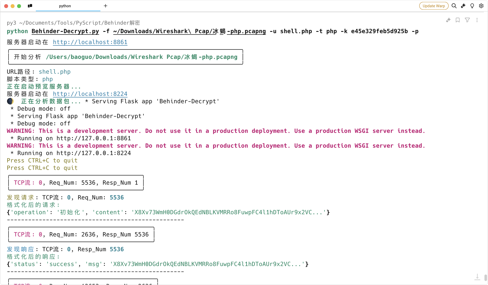
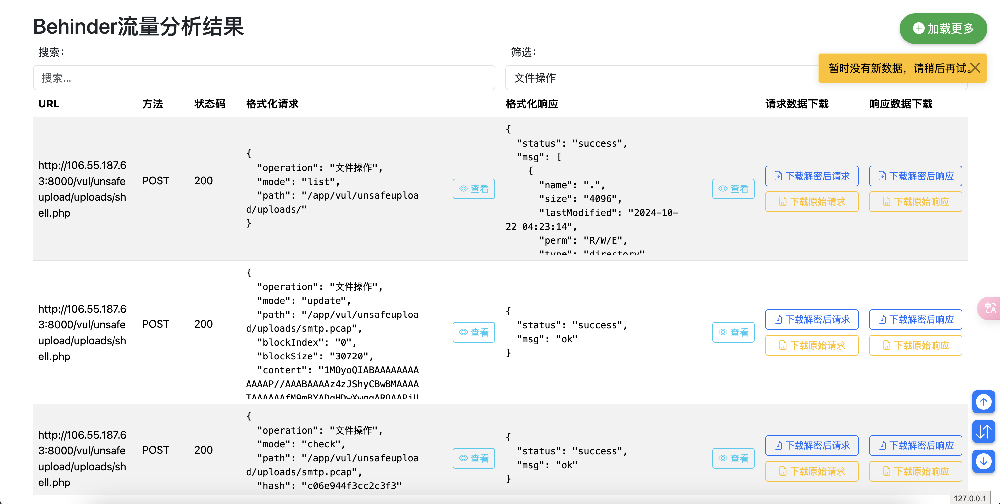

# Behinder流量解密工具

这是一个用于解密Behinder（冰蝎）webshell流量的Python工具。它能够分析pcap文件，解密并格式化Behinder的HTTP请求和响应数据。

项目地址：[ba0gu0/behinder-decryptor](https://github.com/ba0gu0/behinder-decryptor)

## 功能特点

1. 支持解析pcap文件中的HTTP流量
2. 支持多种webshell类型：PHP、ASP、ASPX、JSP
3. 能够解密Behinder的加密流量
4. 针对asmx、自定义传输协议等，支持通过编写自定义解密函数实现解密，解密函数会接受到原始的请求数据
5. 格式化并输出解密后的请求和响应数据
6. 将解密结果保存为JSONL文件
7. 提供Web界面用于查看和分析解密结果

## 安装

1. 克隆此仓库：
   ```
   git clone https://github.com/ba0gu0/behinder-decryptor.git
   ```

2. 安装依赖：
   ```
   pip install -r requirements.txt
   ```

## 使用方法

基本用法：

```
python Behinder-Decrypt.py -f <pcap文件> -u <URL路径> -t <脚本类型> -k <密文> [-c <自定义解密代码文件>] [-p]
```

参数说明：
- `-f, --file`: pcap文件路径（必需）
- `-u, --url`: URL路径，例如 `/uploads/shell.php`（必需）
- `-t, --type`: 脚本类型，可选值：php, asp, aspx, jsp（必需）
- `-k, --key`: webshell中的密文，类似于 e45e329feb5d925b（必需）
- `-c, --custom_code`: 自定义解密代码文件路径（可选）
- `-p, --preview`: 启动预览服务,将打开浏览器预览数据（可选）

示例：
```
python Behinder-Decrypt.py -f capture.pcap -u /uploads/shell.php -t php -k e45e329feb5d925b -p
```






## 自定义解密

对于asmx、自定义传输协议等特殊情况，您可以提供自定义的解密函数。创建一个Python文件，其中包含名为`custom_decrypt`的函数，并使用`-c`参数指定该文件。

自定义解密函数应具有以下特征：
1. 函数名必须是`custom_decrypt`
2. 接受两个参数：`data`（bytes类型，原始请求数据）和`key`（字符串类型，webshell中的密文）
3. 返回解密后的数据（bytes类型）

请参考`custom_decrypt_example.py`文件了解如何编写自定义解密函数。

## 输出

工具将在控制台输出解密和格式化后的数据，并将完整结果保存为JSONL文件（文件名格式：`<pcap文件名>_decrypted.jsonl`）。

关于JSONL文件格式的更多信息，请参考：[JSON Lines](http://jsonlines.org/)

## Web界面

工具还提供了一个基于Vue.js的Web界面，用于查看和分析解密结果。使用 `-p` 参数运行工具后，会自动启动一个本地服务器并打开Web界面。

Web界面功能：
- 显示解密后的请求和响应数据
- 支持搜索和筛选功能
- 可查看完整的格式化数据
- 支持下载原始和解密后的请求/响应数据

## 注意事项

- 请确保您有权限分析目标流量。
- 本工具仅用于安全研究和授权测试目的。
- 使用自定义解密代码时，请确保代码安全可靠。
- 处理大型pcap文件时可能需要较长时间，请耐心等待。
- 确保提供正确的webshell密文（-k参数），而不是冰蝎连接密码。

## 常见问题

Q: 工具无法正确解密某些流量，应该怎么办？
A: 尝试使用自定义解密函数。确保您使用了正确的webshell密文和脚本类型。对于特殊的传输协议，可能需要编写专门的解密函数。

Q: 如何处理asmx或其他自定义传输协议的流量？
A: 编写一个自定义解密函数，该函数能够处理原始的请求数据。使用 -c 参数指定包含该函数的Python文件。

Q: 为什么某些响应或请求的结果为空？
A: 这可能是因为某些操作卡死未响应，导致解析失败。个别数据包可能会存在这个问题，但不影响整体解析结果。

## 贡献

欢迎提交问题报告、功能请求和代码贡献。请遵循标准的GitHub流程：fork仓库，创建功能分支，提交更改，并创建拉取请求。

## 许可证

本项目采用MIT许可证。详情请参阅LICENSE文件。
